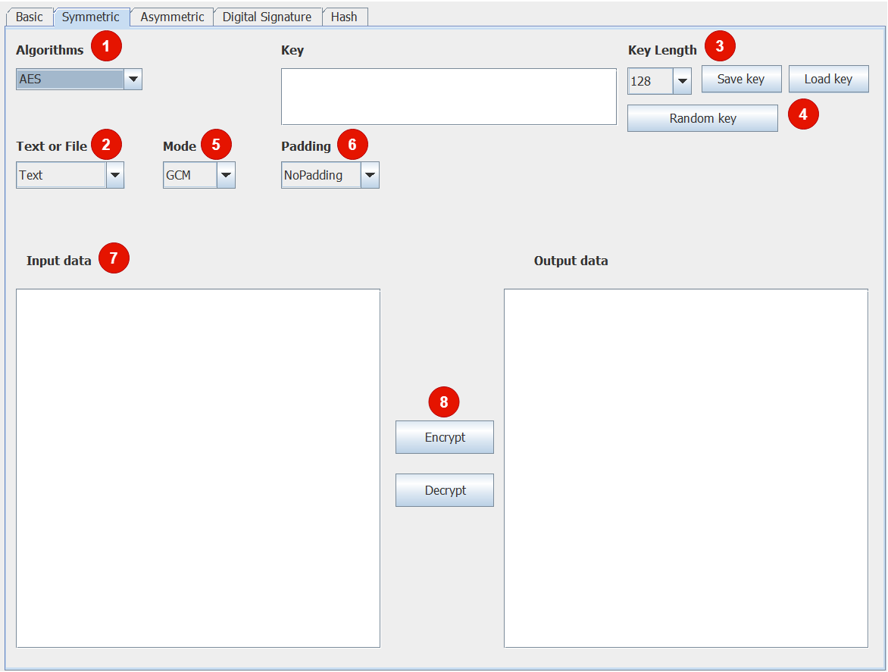
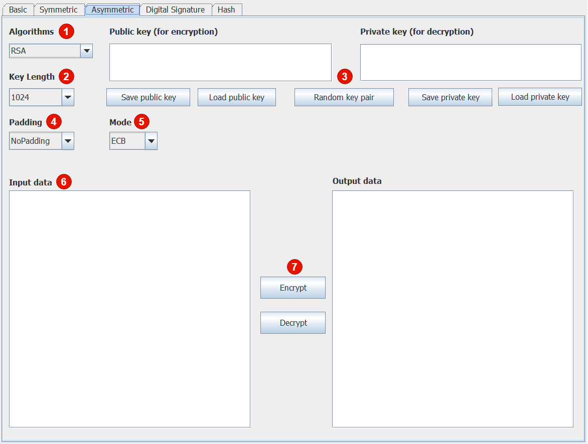

# Encryption Application

This project is a Java-based encryption application that provides various encryption algorithms for text and file
encryption/decryption. The application uses a graphical user interface (GUI) built with Swing.

## Features

- Supports multiple encryption algorithms:

1. **XOR**: A bitwise logic operation where the output is 1 if the two input bits are different and 0 if they are the same.
   Simple but insecure for encryption.
2. **Base64**: Encodes binary data to ASCII using 64 characters (A-Z, a-z, 0-9, +, /). Useful for transmitting binary data
   via text-only protocols.
3. **Caesar Cipher**: Substitutes each character by shifting it a fixed number of positions. A basic but easily breakable
   encryption method.
4. **AES**: A symmetric block cipher encrypting 128-bit blocks with key sizes of 128, 192, or 256 bits. Highly secure and
   widely used.
5. **DES**: A symmetric block cipher encrypting 64-bit blocks with a 56-bit key. Outdated and insecure due to short key
   length.
6. **Blowfish**: A symmetric block cipher for 64-bit blocks with keys from 32 to 448 bits, balancing speed and security.
7. **Affine Cipher**: Uses a linear function 𝐸(𝑥) = ( 𝑎𝑥+ 𝑏 ) mod 𝑚. Simple but vulnerable to frequency analysis.
8. **Vigenère Cipher**: Uses a keyword to shift characters in a text. Stronger than Caesar but still vulnerable to
   frequency analysis.
9. **Permutation Cipher**: Rearranges characters in a message based on a specific rule. Insecure unless combined with
   other methods.
10. **RSA**: An asymmetric encryption algorithm relying on the difficulty of factoring large primes. Used in HTTPS and
    secure key exchange.
11. **ElGamal**: Asymmetric encryption using discrete logarithms. Provides strong security but slower than RSA.
12. **ECIES**: Combines elliptic curve cryptography with symmetric encryption for high security and efficiency with short
    keys.
13. **MD5**: Produces a 128-bit hash. Widely used historically but insecure due to collision vulnerabilities.
14. **SHA-256**: Creates a 256-bit hash. Strong and widely used for secure data hashing.
15. **SHA-512**: Generates a 512-bit hash, offering stronger security than SHA-256 for high-security needs.
16. **HMAC-SHA512**: Combines SHA-512 with a secret key to ensure data integrity and authenticity.
17. **Digital Signature**: Uses a private key to sign data and a public key to verify the signature. Ensures data integrity
    and authenticity.

- Allows encryption and decryption of text and files.
- Provides options for different modes and paddings for supported algorithms.
- Key management features including key generation, loading, and saving.

## Prerequisites

- Java Development Kit (JDK) 11 or higher
- IntelliJ IDEA or any other Java IDE

## Getting Started

### Clone the Repository

```sh
git clone https://github.com/Gilgamesh-hoang/JavaEncrytionGUI.git
cd JavaEncrytionGUI
```

### Open the Project

1. Open IntelliJ IDEA.
2. Select `File` -> `Open...`.
3. Navigate to the cloned repository directory and select it.

### Build and Run

1. Build paths to the BouncyCastle library in the project structure.
2. Open the `src/Main.java` file.
3. Click the `Run` button or press `Shift + F10` to build and run the application.

## Usage

1. Launch the application.
2. Select the type of data to encrypt/decrypt (Text or File).
3. Choose the desired encryption algorithm from the dropdown menu.
4. Enter the required parameters (key, mode, padding, etc.).
5. Click the `Encrypt` or `Decrypt` button to perform the operation.
6. The result will be displayed in the output area or saved to the specified file.

## Project Structure

- `src/`
    - `view/`
        - `MainView.java`: The main GUI frame of the application.
        - `SymmetricPanel.java`: The panel for symmetric encryption algorithms.
    - `model/`
        - `KeyPair.java`: Model class for key pairs.
    - `util/`
        - `EncryptionUtil.java`: Utility class for encryption-related operations.
    - `Main.java`: The entry point of the application.

## Dependencies

- BouncyCastle: A cryptographic library for Java.

## Adding New Algorithms

To add a new encryption algorithm:

1. Create a new class that extends `AbstractEncryptionAlgorithm`.
2. Implement the required
   methods (`encrypt`, `decrypt`, `requireKey`, `isValidKey`, `generateKey`, `getInvalidKeyMessage`, `getKeyLengths`, `getPaddings`, `getModes`, `name`).
3. Update the GUI to include the new algorithm in the dropdown menu.

## License

This project is licensed under the MIT License. See the `LICENSE` file for details.

## Acknowledgements

- BouncyCastle for providing the cryptographic library.
- Java Swing for the GUI components.

## Contact

For any questions or issues, please contact [Gilgamesh-hoang](https://github.com/Gilgamesh-hoang).

## Example Encryption GUI


